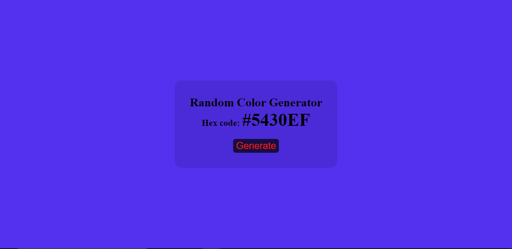

<!-- Please update value in the {}  -->

<h1 align="center">RANDOM-COLOR-GENERATOR</h1>

  <h3>
    <a href="https://hexcolorgenerator-app.netlify.app/">
     >> Demo <<
    </a>   
  </h3>

## Overview

### About
 This is an app that generates random color in hex code and changes the background color of the page.

### Built With

- HTML
- CSS
- JavaScript

## Contact

- Website [ScriptoPlankton](https://sandeep.netlify.app/)
- GitHub [@sandeepashok](https://github.com/sandeepashok)

